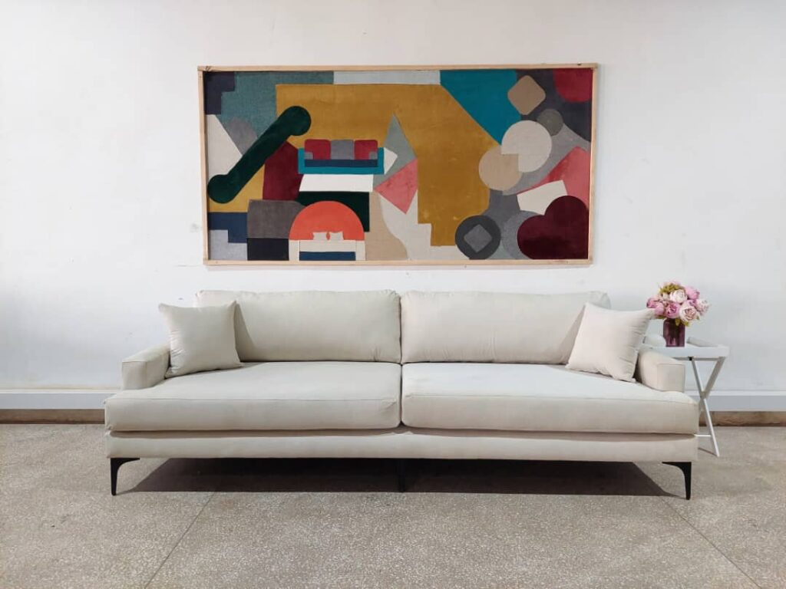

## PROMPT

What about what comes before that, like the base reset for the CSS, the variables, short summary on the approach to be taken

## CLAUDE

## Overview

This guide documents the process of rebuilding the Winteriors website from scratch, section by section. The goal of this first pass is to produce an accurate desktop reproduction of the current site. Mobile responsiveness will be handled separately once the desktop layout is complete and stable.

The approach is incremental — each step adds one piece of the page, with the HTML and CSS growing together. Every step shows the full updated HTML for its section so you can follow along without losing context.

---

## Project Structure

Before writing any code, set up the following files and folders in your project directory:

```
winteriors/
├── index.html
├── fontawesome/
│   └── css/
│       └── all.min.css
├── font/
│   ├── Winteriors.woff2
│   └── Winteriors.woff
├── logo-white.png
└── hero-1024x768.jpeg
```

Font Awesome provides the icons used in the top bar and header. The Winteriors font is a custom display font used exclusively for the brand name in the header. Both are loaded via the `<head>` of `index.html`.

---

## Base HTML Shell

Start with a blank `index.html`. This is the skeleton that everything else will be added into. The `<link>` tag loads Font Awesome. The `<style>` block inside `<head>` is where all CSS will live for now — no separate stylesheet yet.

```html
<!DOCTYPE html>
<html lang="en">
<head>
    <meta charset="UTF-8">
    <meta name="viewport" content="width=device-width, initial-scale=1.0">
    <link rel="stylesheet" href="fontawesome/css/all.min.css">
    <title>Winteriors - Beautiful Sofas Zambia</title>
    <style>
        /* CSS goes here */
    </style>
</head>
<body>
    <!-- HTML goes here -->
</body>
</html>
```

---

## CSS Reset

The reset comes first inside the `<style>` block, before any custom styles. Its job is to strip out the inconsistent default styles that different browsers apply, so everything starts from a clean, predictable baseline.

```css
*, *::before, *::after {
    box-sizing: border-box;
    margin: 0;
    padding: 0;
}

html {
    -webkit-text-size-adjust: 100%;
}

body {
    line-height: 1.5;
    -webkit-font-smoothing: antialiased;
}

img, picture, video, canvas, svg {
    display: block;
    max-width: 100%;
}

input, button, textarea, select {
    font: inherit;
}

p, h1, h2, h3, h4, h5, h6 {
    overflow-wrap: break-word;
}

#root, #__next {
    isolation: isolate;
}
```

A few things worth noting here. `box-sizing: border-box` is applied universally — this makes width and height calculations include padding and border, which is almost always what you want. `img { display: block }` removes the small gap that appears below inline images. `font: inherit` on form elements stops browsers from overriding the page font inside inputs and buttons.

---

## CSS Custom Properties

Directly after the reset, define the CSS variables. These sit on `:root` so they are accessible anywhere on the page. The idea is that any colour used more than once in the design lives here as a variable — this makes future design changes (tweaking the background, swapping the accent gold) a one-line edit rather than a find-and-replace across the whole stylesheet.

```css
:root {
    --text:       #292929;
    --bg:         #FFFFFF;
    --bg-subtle:  #F5F5F5;
    --border:     #EAEAEA;
    --accent:     #D1BC92; /* warm gold */
}
```

There is also an `.inverted` class that flips `--text` and `--bg`. This is used by the top bar to achieve its dark background without writing a separate set of colour rules. Any element that needs the inverted dark theme just receives this class.

```css
.inverted {
    --text: #FFFFFF;
    --bg:   #292929;
}
```

---

## Custom Font

The Winteriors font is loaded via `@font-face` and used only for the brand name in the header. Two formats are provided — `woff2` for modern browsers and `woff` as a fallback. `font-display: swap` ensures the text remains visible using a system font while the custom font loads, rather than hiding it.

```css
@font-face {
    font-family: 'Winteriors';
    src: url('font/Winteriors.woff2') format('woff2'),
         url('font/Winteriors.woff') format('woff');
    font-weight: normal;
    font-style: normal;
    font-display: swap;
}
```

---

## Body Defaults

Finally, set the default styles on `body`. The font stack uses system fonts for now — `Segoe UI` first, with fallbacks. This keeps load times fast and body text readable. The Winteriors display font is intentionally not used here; it is only applied to the brand name `<h1>` in the header.

```css
body {
    margin: 0 auto;
    font-family: 'Segoe UI', Tahoma, Geneva, Verdana, sans-serif;
    color: var(--text);
    background: var(--bg);
}
```

---

With the reset, variables, font, and body defaults in place the stylesheet is ready. The `index.html` at this point should render as a completely blank white page with no visible content — that is the correct starting point before adding sections.

## PROMPT

For the given text: `<a href="#"></a>`, what do you call the part `href="#"`?

## CHATGPT

In the HTML snippet `<a href="#"></a>`, the part `href="#"` is called an **attribute**.

More specifically:

* `href` is the **attribute name**
* `"#"` is the **attribute value**

So the full breakdown:

* `<a>` → the **opening tag**
* `href="#"` → an **attribute (name + value pair)** inside the tag

If you want to be precise, you can say:

> "`href` attribute of the anchor tag"

Let me know if you want a deeper breakdown of how attributes work 👍


## PROMPT

Please give me your answer as a step by step guide written in markdown format

## CLAUDE

Got it — much more narrative and conversational, building up the HTML incrementally with each sub-section, and including your own reasoning/questions inline. Here's the rewritten guide in that style:

---

Sure! Here's the same style guide for the Top Bar, Header, and Hero sections:

---

## Add Top Bar

### Top Bar Wrapper

The top bar is the first element on the page. It sits above the header and contains the company email on the left and social media links on the right. The wrapper fills the full width of the viewport. It uses the `.inverted` class which flips the CSS variables so that `--bg` becomes `#292929` (dark) and `--text` becomes `#FFFFFF` (white).

```html
<div class="topbar-wrapper inverted">
</div>
```

```css
.topbar-wrapper {
    color: var(--text);
    background: var(--bg);
}
```

No extra CSS is needed for the inverted dark background — the `.inverted` class is already defined in the base setup:

```css
.inverted {
    --text: #FFFFFF;
    --bg: #292929;
}
```

### Top Bar Inner Container

The inner `.topbar` div is what constrains the content to 1140px and centres it. It is 36px tall and uses flexbox with `justify-content: space-between` to push the email to the left and socials to the right.

```html
<div class="topbar-wrapper inverted">
    <div class="topbar">
    </div>
</div>
```

```css
.topbar {
    max-width: 1140px;
    margin: 0 auto;
    height: 36px;
    display: flex;
    justify-content: space-between;
    padding: 0 8px;
}
```

### Email

The email address sits on the left side of the top bar. It uses a Font Awesome envelope icon followed by the email text. Both are wrapped in a flex row with a small gap between them. Font size is kept small at 14px to match the slim height of the bar.

```html
<div class="topbar-wrapper inverted">
    <div class="topbar">
        <div class="email">
            <i class="fa-solid fa-envelope"></i>
            <div>hello@winteriorz.com</div>
        </div>
    </div>
</div>
```

```css
.topbar .email {
    display: flex;
    align-items: center;
    gap: 0.3rem;
    font-size: 14px;
    line-height: 1;
}
```

### Social Icons

The socials sit on the right side. Each social link is an anchor `<a>` tag containing a Font Awesome brand icon. Each link is styled as a small circle — 24x24px with `border-radius: 50%`. The white background with dark icon creates a pill-like icon that sits against the dark top bar background.

```html
<div class="topbar-wrapper inverted">
    <div class="topbar">
        <div class="email">
            <i class="fa-solid fa-envelope"></i>
            <div>hello@winteriorz.com</div>
        </div>
        <div class="socials">
            <a href="https://facebook.com/winteriorszambia" target="_blank">
                <i class="fa-brands fa-facebook-f"></i>
            </a>
            <a href="https://wa.me/c/260776987155" target="_blank">
                <i class="fa-brands fa-whatsapp"></i>
            </a>
            <a href="https://instagram.com/winteriorszambia" target="_blank">
                <i class="fa-brands fa-instagram"></i>
            </a>
        </div>
    </div>
</div>
```

```css
.topbar .socials {
    display: flex;
    align-items: center;
    gap: 1rem;
}

.topbar .socials a {
    display: flex;
    align-items: center;
    justify-content: center;
    width: 24px;
    height: 24px;
    border-radius: 50%;
    background: #FFFFFF;
    color: #292929;
    text-decoration: none;
    font-size: 12px;
}
```

### Social Icons Hover

On hover, the icon background switches to the brand gold and the circle shrinks slightly with `transform: scale(0.9)`. The scale-down on hover is an unusual but intentional choice — it feels like a physical press rather than the usual scale-up.

```css
.topbar .socials a:hover {
    background: #D1BC92;
    opacity: 0.9;
    transform: scale(0.9);
}
```

---

## Add Header

### Header Wrapper

The header wrapper sits directly below the top bar. Unlike the top bar it uses the default light theme — white background, dark text. The wrapper again fills the full viewport width.

```html
<div class="header-wrapper">
</div>
```

```css
.header-wrapper {
    color: var(--text);
    background: var(--bg); /* #FFFFFF */
}
```

### Header Inner Container

The inner `<header>` element constrains content to 1140px, centres it, and uses flexbox with `space-between` to place the logo on the left, nav in the middle-right, and hamburger on the far right. Height is 64px — taller than the top bar to give the logo room to breathe.

```html
<div class="header-wrapper">
    <header>
    </header>
</div>
```

```css
header {
    max-width: 1140px;
    margin: 0 auto;
    height: 64px;
    display: flex;
    justify-content: space-between;
    padding: 6px 8px;
}
```

### Logo

The logo area sits on the left. It contains a logo image and the brand name in the custom Winteriors display font. The `<h1>` uses the Winteriors font with uppercase text and wide letter-spacing. Font size is kept at `1rem` — the display font is decorative so it reads well even at a small size.

```html
<div class="header-wrapper">
    <header>
        <div class="logo">
            
            <h1>Winteriors</h1>
        </div>
    </header>
</div>
```

```css
header .logo {
    display: flex;
    align-items: center;
    gap: 0.5rem;
}

header .logo img {
    height: 36px;
}

h1 {
    font-family: 'Winteriors', 'Times New Roman', serif;
    text-transform: uppercase;
    letter-spacing: 6px;
    font-size: 1rem;
}
```

### Quick Links Nav

The quick links are a horizontal row of nav links for desktop. They sit to the right of the logo. These will be hidden on mobile when the hamburger menu takes over — that will be handled later in the mobile responsiveness pass.

```html
<div class="header-wrapper">
    <header>
        <div class="logo">
            
            <h1>Winteriors</h1>
        </div>
        <nav class="quicklinks">
            <a href="#">Home</a>
            <a href="#">Shop</a>
            <a href="#">About</a>
            <a href="#">Contact</a>
        </nav>
    </header>
</div>
```

```css
header .quicklinks {
    display: flex;
    gap: 1rem;
    align-items: center;
}

header a {
    text-decoration: none;
    color: inherit;
}
```

### Hamburger Menu & Dropdown

The hamburger icon and its dropdown are the mobile-first alternative to the quick links. The `.menu` div wraps both the icon and the dropdown nav. The dropdown is hidden by default using `display: none` and shown by toggling the `.open` class via JavaScript.

The dropdown is absolutely positioned below the hamburger icon using `top: 100%`, and aligned to the right edge with `right: 0`. It displays links in a vertical column.

```html
<div class="header-wrapper">
    <header>
        <div class="logo">
            
            <h1>Winteriors</h1>
        </div>
        <nav class="quicklinks">
            <a href="#">Home</a>
            <a href="#">Shop</a>
            <a href="#">About</a>
            <a href="#">Contact</a>
        </nav>
        <div class="menu">
            <i class="fa-solid fa-bars" id="menu-toggle"></i>
            <nav class="dropdown">
                <a href="#">Home</a>
                <a href="#">Shop</a>
                <a href="#">About</a>
                <a href="#">Contact</a>
            </nav>
        </div>
    </header>
</div>
```

```css
header .menu {
    position: relative;
    cursor: pointer;
    align-self: center;
}

.dropdown {
    display: none;
    position: absolute;
    top: 100%;
    right: 0;
    background: var(--bg);
    border: 1px solid var(--border);
    min-width: 160px;
    flex-direction: column;
    z-index: 100;
}

.dropdown a {
    padding: 12px 16px;
    display: block;
    color: var(--text);
}

.dropdown a:hover {
    background: var(--bg-subtle);
}

.dropdown.open {
    display: flex;
}
```

### Dropdown JavaScript

Two event listeners handle the dropdown. The first toggles `.open` on the hamburger click. The second closes the dropdown when clicking anywhere else on the page. Note that the outside-click listener checks `toggle.contains(e.target)` — without this, clicking the hamburger itself would trigger both listeners and the dropdown would immediately close again.

```html
<script>
    const toggle = document.getElementById('menu-toggle');
    const dropdown = document.querySelector('.dropdown');

    toggle.addEventListener('click', () => {
        dropdown.classList.toggle('open');
    });

    document.addEventListener('click', (e) => {
        if (!toggle.contains(e.target)) {
            dropdown.classList.remove('open');
        }
    });
</script>
```

---

## Add Hero Section

### Hero Wrapper

The hero wrapper fills the full viewport width and uses `--bg-subtle` (`#F5F5F5`) as a background to visually separate it from the white header above it.

```html
<div class="hero-wrapper">
</div>
```

```css
.hero-wrapper {
    background: var(--bg-subtle); /* #F5F5F5 */
}
```

### Hero Grid

The inner `.hero` div constrains content to 1140px and uses a two-column grid — left column for the text content, right column for the image. The bottom padding is intentionally large at `180px` to create generous breathing room before the categories section below. This may need adjusting as the page develops.

```html
<div class="hero-wrapper">
    <div class="hero">
    </div>
</div>
```

```css
.hero {
    max-width: 1140px;
    margin: 0 auto;
    display: grid;
    padding: 60px 8px 180px 8px;
    grid-template-columns: 1fr 1fr;
    gap: 2rem;
    align-items: center;
}
```

### Hero Text Content

The left column holds the headline, a paragraph, and a CTA button. The headline is large and uppercase. The paragraph uses a muted grey (`#7A7A7A`) to de-emphasise it relative to the headline and CTA. There is a `margin-bottom: 2.5rem` on the paragraph to give space before the button.

```html
<div class="hero-wrapper">
    <div class="hero">
        <div>
            <h2>Celebrating Living Spaces!</h2>
            <p>At Winteriors, we are passionate about making your living or communal spaces worth celebrating! We specialise in the supply of fashionable and affordable furniture for both residential and commercial spaces, all the while working towards being the best furniture hub where you as our customer are valued individually and are given the best value for your money!</p>
            <a href="#">Shop Now</a>
        </div>
    </div>
</div>
```

```css
.hero h2 {
    text-transform: uppercase;
    font-size: 51px;
    margin-bottom: 1rem;
    line-height: 1.2;
    letter-spacing: 1.5px;
}

.hero p {
    margin-bottom: 2.5rem;
    color: #7A7A7A;
}
```

### Hero CTA Button

The "Shop Now" link is styled as a solid dark button. On hover, it inverts — white background with a dark border and dark text. Note that the default state has no border, so a `border: 1px solid #292929` is only added on hover. This means the button will shift size by 1px on hover unless a transparent border is pre-set in the default state. Worth revisiting if a layout shift is noticeable.

```css
.hero a {
    text-decoration: none;
    text-transform: uppercase;
    letter-spacing: 1.2px;
    background: #292929;
    color: #FFFFFF;
    padding: 16px 36px;
    font-weight: bold;
}

.hero a:hover {
    background: #FFFFFF;
    color: #292929;
    border: 1px solid #292929;
}
```

### Hero Image

The right column holds a circular image container. The circle is achieved with `border-radius: 50%` on a fixed 600x600px div. The background colour `#EDE8DF` — a warm beige — shows as a fallback while the image loads. The image itself uses `object-fit: cover` so it fills the circle without distorting regardless of the source image dimensions.

```html
<div class="hero-wrapper">
    <div class="hero">
        <div>
            <h2>Celebrating Living Spaces!</h2>
            <p>At Winteriors, we are passionate about making your living or communal spaces worth celebrating! We specialise in the supply of fashionable and affordable furniture for both residential and commercial spaces, all the while working towards being the best furniture hub where you as our customer are valued individually and are given the best value for your money!</p>
            <a href="#">Shop Now</a>
        </div>
        <div class="hero-image">
            
        </div>
    </div>
</div>
```

```css
.hero-image {
    width: 600px;
    height: 600px;
    border-radius: 50%;
    background: #EDE8DF;
    justify-self: center;
    overflow: hidden;
}

.hero-image img {
    width: 100%;
    height: 100%;
    object-fit: cover;
}
```

---

## Add Categories Section

### Categories Wrapper

In this step we will add the Categories Section. The Categories section will include a `categories-wrapper` div. This div is supposed to fill the full width of the viewport. It will have a background color of `#FFFFFF`.

Here is the HTML:
```html
<div class="categories-wrapper"></div>
```

Here is the corresponding CSS:
```css
.categories-wrapper {
    background: var(--bg); /* #FFFFFF */
}
```

### Categories Grid

Next comes the `categories` div, nested inside `categories-wrapper`. It has a maximum width of 1140px with content centred using `margin: 0 auto`. Top and bottom padding will be 60px, left and right padding will be 8px — this can be adjusted later based on visual feedback or mobile needs. Since this section holds category cards side by side, the layout will be a 4-column grid with each column representing one card.

Here is the updated HTML:
```html
<div class="categories-wrapper">
    <div class="categories">
    </div>
</div>
```

Here is the corresponding CSS:
```css
.categories-wrapper {
    background: var(--bg); /* #FFFFFF */
}

.categories {
    max-width: 1140px;
    margin: 0 auto;
    padding: 60px 8px;
    display: grid;
    grid-template-columns: repeat(4, 1fr);
    gap: 1rem;
}
```

### Category Card

Each category card uses an anchor `<a>` tag as the container, making the entire card clickable. The class name is `category-card` and it sits directly inside the `.categories` grid.

Each card holds three pieces of content, stacked vertically:
- A **tag** label (e.g. "New Arrivals") using a `<span class="tag">`
- A **category name** (e.g. "Furniture") using an `<h3>`
- A **call to action** ("Shop Now") using a `<span class="shop-link">`

A note on the `<h3>` — still debating whether this should be an `<h2>` instead, since the hero section above already uses an `<h2>`. Will revisit once the full page structure is clearer.

For the styling, the card background uses `--bg-subtle` (`#F5F5F5`) to differentiate it from the white `categories-wrapper` behind it. The card is a flex column to stack the three text items vertically. Text colour is `--text` (`#292929`). There is a `transition: background 0.2s` applied — this is in anticipation of the hover state added in the next step.

Here is the updated HTML:
```html
<div class="categories-wrapper">
    <div class="categories">
        <a class="category-card" href="#">
            <span class="tag">New Arrivals</span>
            <h3>Furniture</h3>
            <span class="shop-link">Shop Now</span>
        </a>
    </div>
</div>
```

Here is the corresponding CSS:
```css
.categories-wrapper {
    background: var(--bg); /* #FFFFFF */
}

.categories {
    max-width: 1140px;
    margin: 0 auto;
    padding: 60px 8px;
    display: grid;
    grid-template-columns: repeat(4, 1fr);
    gap: 1rem;
}

.category-card {
    background: var(--bg-subtle); /* #F5F5F5 */
    padding: 24px 20px 20px 20px;
    display: flex;
    flex-direction: column;
    gap: 0.5rem;
    text-decoration: none;
    color: var(--text); /* #292929 */
    transition: background 0.2s;
}
```

### Category Card Hover

When a user hovers over a card, the background darkens slightly to `#EDEAE4` — a warm off-white that sits between `--bg-subtle` and the card's natural beige tones. This gives a subtle interactive feel without being too heavy.

```css
.category-card:hover {
    background: #EDEAE4;
}
```

### Category Card — Tag

The `.tag` span is the first item inside the card. It is styled in a small uppercase label style using the brand's gold accent colour `#D1BC92`. The intent is to communicate the promotional label (e.g. "Sale", "New Arrivals") at a glance before the eye reaches the category name below it.

```css
.category-card .tag {
    font-size: 11px;
    text-transform: uppercase;
    letter-spacing: 1.5px;
    color: var(--accent); /* #D1BC92 */
    font-weight: 600;
}
```

### Category Card — Name

The `<h3>` for the category name is bold and uppercase, slightly larger than the tag above it. The bottom margin creates a small gap between the name and the Shop Now link below.

```css
.category-card h3 {
    font-size: 15px;
    text-transform: uppercase;
    letter-spacing: 1px;
    font-weight: 700;
    margin-bottom: 0.5rem;
}
```

### Category Card — Shop Now Link

The `.shop-link` span mimics a text link. Rather than using an actual arrow character in the HTML, a CSS `::after` pseudo-element injects the `→` arrow. This keeps the HTML clean and makes it easy to swap the arrow style later from one place in the CSS.

```css
.category-card .shop-link {
    font-size: 11px;
    text-transform: uppercase;
    letter-spacing: 1px;
    display: flex;
    align-items: center;
    gap: 4px;
}

.category-card .shop-link::after {
    content: '→';
}
```

### All Four Cards

Now that one card is styled, replicate it three more times inside `.categories` for the remaining categories. The grid will automatically place them across four columns.

```html
<div class="categories-wrapper">
    <div class="categories">
        <a class="category-card" href="#">
            <span class="tag">New Arrivals</span>
            <h3>Furniture</h3>
            <span class="shop-link">Shop Now</span>
        </a>
        <a class="category-card" href="#">
            <span class="tag">Discount</span>
            <h3>Living Room</h3>
            <span class="shop-link">Shop Now</span>
        </a>
        <a class="category-card" href="#">
            <span class="tag">Sale</span>
            <h3>Bedroom</h3>
            <span class="shop-link">Shop Now</span>
        </a>
        <a class="category-card" href="#">
            <span class="tag">Sale</span>
            <h3>Hotel</h3>
            <span class="shop-link">Shop Now</span>
        </a>
    </div>
</div>
```

No new CSS needed — all four cards share the same `.category-card` styles already written.

---

## Add Best Selling Section

### Section Heading Pattern

Before building the grid, a reusable section heading pattern is introduced here. It will also be used by the Featured Products section, so the CSS only needs to be written once.

The heading is centred text flanked on both sides by a horizontal rule. This is achieved with flexbox — the `::before` and `::after` pseudo-elements grow to fill available space on either side of the `<h2>`, pushing it to the centre. No extra wrapper or `<hr>` elements needed.

```html
<div class="section-heading-wrapper">
    <div class="section-heading">
        <h2>Best Selling</h2>
    </div>
</div>
```

```css
.section-heading-wrapper {
    max-width: 1140px;
    margin: 0 auto;
    padding: 0 8px;
}

.section-heading {
    display: flex;
    align-items: center;
    gap: 1.5rem;
    margin-bottom: 40px;
}

.section-heading::before,
.section-heading::after {
    content: '';
    flex: 1;
    height: 1px;
    background: var(--border); /* #EAEAEA */
}

.section-heading h2 {
    font-size: 13px;
    text-transform: uppercase;
    letter-spacing: 3px;
    font-weight: 700;
    white-space: nowrap;
}
```

### Best Selling Wrapper & Grid

The wrapper provides top padding of 60px to breathe after the categories section. The inner grid follows the same max-width and centering pattern as before, with 4 equal columns for 4 product cards.

```html
<div class="best-selling-wrapper">
    <div class="section-heading-wrapper">
        <div class="section-heading">
            <h2>Best Selling</h2>
        </div>
    </div>
    <div class="best-selling-grid">
    </div>
</div>
```

```css
.best-selling-wrapper {
    padding: 60px 0 0 0;
}

.best-selling-grid {
    max-width: 1140px;
    margin: 0 auto;
    padding: 0 8px 60px 8px;
    display: grid;
    grid-template-columns: repeat(4, 1fr);
    gap: 1.5rem;
}
```

### Product Card

Each product card is an anchor `<a>` tag with the class `product-card`. It contains two things: an image area and an info row with the product name and price.

The image area uses `aspect-ratio: 3 / 4` to keep cards portrait-shaped, which suits furniture photography. The background `--bg-subtle` shows while the image is loading or if no image is set yet. Real product images go inside as `` tags — the CSS handles sizing automatically via `object-fit: cover`.

The info row uses `justify-content: space-between` to push the name to the left and the price to the right.

```html
<div class="best-selling-grid">
    <a class="product-card" href="#">
        <div class="product-card-image">
            <!--  goes here -->
        </div>
        <div class="product-card-info">
            <span class="name">Accent Chair</span>
            <span class="price">K 4,500</span>
        </div>
    </a>
    <!-- repeat ×3 for remaining products -->
</div>
```

```css
.product-card {
    display: flex;
    flex-direction: column;
    text-decoration: none;
    color: var(--text);
    gap: 0.75rem;
}

.product-card-image {
    background: var(--bg-subtle);
    aspect-ratio: 3 / 4;
    overflow: hidden;
}

.product-card-image img {
    width: 100%;
    height: 100%;
    object-fit: cover;
    transition: transform 0.4s ease;
}

.product-card:hover .product-card-image img {
    transform: scale(1.04);
}

.product-card-info {
    display: flex;
    justify-content: space-between;
}

.product-card-info .name {
    font-size: 13px;
    text-transform: uppercase;
    letter-spacing: 1px;
    font-weight: 600;
}

.product-card-info .price {
    font-size: 13px;
    color: #7A7A7A;
}
```

---

## Add Featured Products Section

### Wrapper & Section Heading

The Featured Products section reuses the `.section-heading` pattern from Best Selling — no new CSS needed for the heading. The wrapper adds `60px` padding top and bottom.

```html
<div class="featured-wrapper">
    <div class="section-heading-wrapper">
        <div class="section-heading">
            <h2>Featured Products</h2>
        </div>
    </div>
</div>
```

```css
.featured-wrapper {
    padding: 60px 0;
}
```

### Featured Grid

The featured grid is a 2-column layout at the top level — the left column holds one tall card, and the right column holds two stacked cards. The grid itself only defines these two equal columns. The height difference between left and right is handled by the cards themselves, not the grid.

```html
<div class="featured-wrapper">
    <div class="section-heading-wrapper">
        <div class="section-heading">
            <h2>Featured Products</h2>
        </div>
    </div>
    <div class="featured-grid">
    </div>
</div>
```

```css
.featured-grid {
    max-width: 1140px;
    margin: 0 auto;
    padding: 0 8px;
    display: grid;
    grid-template-columns: 1fr 1fr;
    gap: 1rem;
}
```

### Featured Card — Shared Styles

All three featured cards share the same base styles. The card is a flex column: content sits at the top, and the image fills the remaining space below via `flex: 1` on `.featured-card-image`. Hover darkens the background the same way the category cards do.

```css
.featured-card {
    background: var(--bg-subtle);
    display: flex;
    flex-direction: column;
    text-decoration: none;
    color: var(--text);
    overflow: hidden;
    transition: background 0.2s;
}

.featured-card:hover {
    background: #EDEAE4;
}

.featured-card-content {
    padding: 28px 28px 0 28px;
}

.featured-card h3 {
    font-size: 15px;
    text-transform: uppercase;
    letter-spacing: 1.5px;
    font-weight: 700;
    margin-bottom: 4px;
}

.featured-card .subtitle {
    font-size: 12px;
    color: #7A7A7A;
    margin-bottom: 1rem;
}

.featured-card .discover-link {
    font-size: 11px;
    text-transform: uppercase;
    letter-spacing: 1px;
    display: flex;
    align-items: center;
    gap: 4px;
    margin-bottom: 24px;
}

.featured-card .discover-link::after {
    content: '→';
}

.featured-card-image {
    flex: 1;
    min-height: 220px;
    overflow: hidden;
    background: #EEEBE6;
}

.featured-card-image img {
    width: 100%;
    height: 100%;
    object-fit: cover;
    transition: transform 0.4s ease;
}

.featured-card:hover .featured-card-image img {
    transform: scale(1.04);
}
```

### Left — Tall Card

The left card spans the full height of the grid row. Its image area gets a `min-height: 420px` to make it noticeably taller than the two right cards.

```html
<div class="featured-grid">
    <a class="featured-card" href="#">
        <div class="featured-card-content">
            <h3>Lamp &amp; Table</h3>
            <p class="subtitle">Discover this week's new arrivals</p>
            <span class="discover-link">Discover Now</span>
        </div>
        <div class="featured-card-image">
            <!--  -->
        </div>
    </a>
</div>
```

The tall card image override:
```css
.featured-card-tall .featured-card-image {
    min-height: 420px;
}
```

### Right — Two Stacked Cards

The right column is a `<div class="featured-right">` that stacks two cards vertically using flex column. Each card gets `flex: 1` so they share the column height equally.

```html
<div class="featured-grid">

    <a class="featured-card featured-card-tall" href="#">
        <div class="featured-card-content">
            <h3>Lamp &amp; Table</h3>
            <p class="subtitle">Discover this week's new arrivals</p>
            <span class="discover-link">Discover Now</span>
        </div>
        <div class="featured-card-image"></div>
    </a>

    <div class="featured-right">
        <a class="featured-card" href="#">
            <div class="featured-card-content">
                <h3>Dresser</h3>
                <p class="subtitle">Discover this week's new arrivals</p>
                <span class="discover-link">Discover Now</span>
            </div>
            <div class="featured-card-image"></div>
        </a>
        <a class="featured-card" href="#">
            <div class="featured-card-content">
                <h3>Chair &amp; Sofa</h3>
                <p class="subtitle">Discover this week's new arrivals</p>
                <span class="discover-link">Discover Now</span>
            </div>
            <div class="featured-card-image"></div>
        </a>
    </div>

</div>
```

```css
.featured-right {
    display: flex;
    flex-direction: column;
    gap: 1rem;
}

.featured-right .featured-card {
    flex: 1;
}
```

## CLAUDE

Looking at the screenshot, I need to build the section below the hero — which includes:
1. A 4-column category cards row (New Arrivals / Discount / Sale / Sale)
2. A "Best Selling" section with a horizontal rule
3. A "Featured Products" section with a 2-column asymmetric grid (Lamp & Table tall card + Dresser/Chair & Sofa stacked cards)

Let me match the existing code's design system exactly.Here's the updated file with the three new sections added below the hero:

**Categories row** — 4 cards (Furniture, Living Room, Bedroom, Hotel) each with a gold tag label (New Arrivals / Discount / Sale), bold uppercase title, and a "Shop Now →" link. All using `var(--bg-subtle)` with a subtle hover darkening.

**Best Selling** — centred heading flanked by horizontal rules (matching the screenshot's style), then a 4-column product grid. Each card has a placeholder image area (aspect-ratio 3:4), product name, and price. Product card images scale slightly on hover.

**Featured Products** — same centred heading, then an asymmetric 2-column grid: a tall left card (Lamp & Table) spanning the full height, and two stacked right cards (Dresser / Chair & Sofa). Each featured card has the title/subtitle/discover link at the top and image filling the rest.

All placeholder image divs are ready to swap out with `` tags once you have the actual product images. The `--accent` variable (`#D1BC92`) is used for the category tags to stay consistent with the brand gold already present in the topbar social icons.

```html
<!DOCTYPE html>
<html lang="en">
<head>
    <meta charset="UTF-8">
    <meta name="viewport" content="width=device-width, initial-scale=1.0">
    <link rel="stylesheet" href="fontawesome/css/all.min.css">
    <title>Winteriors - Beautiful Sofas Zambia</title>

    <style>
        /* Base Reset */
        *, *::before, *::after {
        box-sizing: border-box;
        margin: 0;
        padding: 0;
        }

        html {
        -webkit-text-size-adjust: 100%;
        }

        body {
        line-height: 1.5;
        -webkit-font-smoothing: antialiased;
        }

        img, picture, video, canvas, svg {
        display: block;
        max-width: 100%;
        }

        input, button, textarea, select {
        font: inherit;
        }

        p, h1, h2, h3, h4, h5, h6 {
        overflow-wrap: break-word;
        }

        #root, #__next {
        isolation: isolate;
        }

        /* Variables */
        :root {
            --text: #292929;
            --bg: #FFFFFF;
            --bg-subtle: #F5F5F5;
            --border:    #EAEAEA;
            --accent: #D1BC92;
        }

        .inverted {
            --text: #FFFFFF;
            --bg: #292929;
        }

        /* Custom Font */
        @font-face {
            font-family: 'Winteriors';
            src: url('font/Winteriors.woff2') format('woff2'),
                url('font/Winteriors.woff') format('woff');
            font-weight: normal;
            font-style: normal;
            font-display: swap;
        }

        /* Body */
        body {
            margin: 0 auto;
            font-family: 'Segoe UI', Tahoma, Geneva, Verdana, sans-serif;
            color: var(--text);
            background: var(--bg);
        }

        /* Top Bar */
        .topbar-wrapper {
            color: var(--text);
            background: var(--bg);
        }

        .topbar {
            max-width: 1140px;
            margin: 0 auto;
            height: 36px;
            display: flex;
            justify-content: space-between;
            padding: 0 8px 0 8px;
        }

        .topbar .email {
            display: flex;
            align-items: center;
            gap: 0.3rem;
            font-size: 14px;
            line-height: 1;
        }

        .topbar .socials {
            display: flex;
            align-items: center;
            gap: 1rem;
        }

        .topbar .socials a {
            display: flex;
            align-items: center;
            justify-content: center;
            width: 24px;
            height: 24px;
            border-radius: 50%;
            background: #FFFFFF;
            color: #292929;
            text-decoration: none;
            font-size: 12px;
        }

        .topbar .socials a:hover {
            background: #D1BC92;
            opacity: 0.9;
            transform: scale(0.9);
        }

        /*Header*/
        .header-wrapper {
            color: var(--text);
            background: var(--bg);
        }

        header {
            max-width: 1140px;
            margin: 0 auto;
            height: 64px;
            display: flex;
            justify-content: space-between;
            padding: 6px 8px 6px 8px;
        }

        header .logo {
            display: flex;
            align-items: center;
            gap: 0.5rem;
        }

        header .logo img {
            height: 36px;
        }

        h1 {
            font-family: 'Winteriors', 'Times New Roman', serif;
            text-transform: uppercase;
            letter-spacing: 6;
            font-size: 1rem;
        }

        header .quicklinks {
            display: flex;
            gap: 1rem;
            align-items: center;
        }

        header a {
            text-decoration: none;
            color: inherit;
        }

        header .menu {
            position: relative;
            cursor: pointer;
            align-self: center;
         }

         .dropdown {
            display: none;
            position: absolute;
            top: 100%;
            right: 0;
            background: var(--bg);
            border: 1px solid var(--border);
            min-width: 160px;
            flex-direction: column;
            z-index: 100;
         }

         .dropdown a {
            padding: 12px 16px;
            display: block;
            color: var(--text);
         }

         .dropdown a:hover {
            background: var(--bg-subtle);
         }

         .dropdown.open {
            display: flex;
         }

         .hero-wrapper {
            background: var(--bg-subtle);
         }

         .hero {
            max-width: 1140px;
            margin: 0 auto;
            display: grid;
            padding: 60px 8px 180px 8px;
            grid-template-columns: 1fr 1fr;
            gap: 2rem;
            align-items: center;
         }

         .hero h2 {
            text-transform: uppercase;
            font-size: 51px;
            margin-bottom: 1rem;
            line-height: 1.2;
            letter-spacing: 1.5px;
         }

         .hero p {
            margin-bottom: 2.5rem;
            color: #7A7A7A;
         }

         .hero a {
            text-decoration: none;
            text-transform: uppercase;
            letter-spacing: 1.2px;
            background: #292929;
            color: #FFFFFF;
            padding: 16px 36px;
            font-weight: bold;
         }

         .hero a:hover {
            background: #FFFFFF;
            color: #292929;
            border: 1px solid #292929;
         }

         .hero-image {
            width: 600px;
            height: 600px;
            border-radius: 50%;
            background: #EDE8DF;
            justify-self: center;
            overflow: hidden;
         }

         .hero-image img {
            width: 100%;
            height: 100%;
            object-fit: cover;
         }

        /* =====================
           CATEGORIES SECTION
        ===================== */
        .categories-wrapper {
            background: var(--bg);
        }

        .categories {
            max-width: 1140px;
            margin: 0 auto;
            padding: 60px 8px;
            display: grid;
            grid-template-columns: repeat(4, 1fr);
            gap: 1rem;
        }

        .category-card {
            background: var(--bg-subtle);
            padding: 24px 20px 20px 20px;
            display: flex;
            flex-direction: column;
            gap: 0.5rem;
            text-decoration: none;
            color: var(--text);
            transition: background 0.2s;
        }

        .category-card:hover {
            background: #EDEAE4;
        }

        .category-card .tag {
            font-size: 11px;
            text-transform: uppercase;
            letter-spacing: 1.5px;
            color: var(--accent);
            font-weight: 600;
        }

        .category-card h3 {
            font-size: 15px;
            text-transform: uppercase;
            letter-spacing: 1px;
            font-weight: 700;
            margin-bottom: 0.5rem;
        }

        .category-card .shop-link {
            font-size: 11px;
            text-transform: uppercase;
            letter-spacing: 1px;
            color: var(--text);
            display: flex;
            align-items: center;
            gap: 4px;
        }

        .category-card .shop-link::after {
            content: '→';
            font-size: 13px;
        }

        /* =====================
           SECTION HEADINGS
        ===================== */
        .section-heading-wrapper {
            max-width: 1140px;
            margin: 0 auto;
            padding: 0 8px;
        }

        .section-heading {
            display: flex;
            align-items: center;
            gap: 1.5rem;
            margin-bottom: 40px;
        }

        .section-heading::before,
        .section-heading::after {
            content: '';
            flex: 1;
            height: 1px;
            background: var(--border);
        }

        .section-heading h2 {
            font-size: 13px;
            text-transform: uppercase;
            letter-spacing: 3px;
            font-weight: 700;
            white-space: nowrap;
        }

        /* =====================
           BEST SELLING SECTION
        ===================== */
        .best-selling-wrapper {
            background: var(--bg);
            padding: 60px 0 0 0;
        }

        .best-selling-grid {
            max-width: 1140px;
            margin: 0 auto;
            padding: 0 8px 60px 8px;
            display: grid;
            grid-template-columns: repeat(4, 1fr);
            gap: 1.5rem;
        }

        .product-card {
            display: flex;
            flex-direction: column;
            text-decoration: none;
            color: var(--text);
            gap: 0.75rem;
        }

        .product-card-image {
            background: var(--bg-subtle);
            aspect-ratio: 3 / 4;
            overflow: hidden;
        }

        .product-card-image img {
            width: 100%;
            height: 100%;
            object-fit: cover;
            transition: transform 0.4s ease;
        }

        .product-card:hover .product-card-image img {
            transform: scale(1.04);
        }

        .product-card-image.placeholder {
            display: flex;
            align-items: center;
            justify-content: center;
            color: #CCCCCC;
            font-size: 13px;
            letter-spacing: 1px;
            text-transform: uppercase;
        }

        .product-card-info {
            display: flex;
            justify-content: space-between;
            align-items: flex-start;
        }

        .product-card-info .name {
            font-size: 13px;
            text-transform: uppercase;
            letter-spacing: 1px;
            font-weight: 600;
        }

        .product-card-info .price {
            font-size: 13px;
            color: #7A7A7A;
        }

        /* =====================
           FEATURED PRODUCTS
        ===================== */
        .featured-wrapper {
            background: var(--bg);
            padding: 60px 0;
        }

        .featured-grid {
            max-width: 1140px;
            margin: 0 auto;
            padding: 0 8px;
            display: grid;
            grid-template-columns: 1fr 1fr;
            gap: 1rem;
        }

        /* Left tall card */
        .featured-card {
            background: var(--bg-subtle);
            display: flex;
            flex-direction: column;
            text-decoration: none;
            color: var(--text);
            overflow: hidden;
            position: relative;
            transition: background 0.2s;
        }

        .featured-card:hover {
            background: #EDEAE4;
        }

        .featured-card-tall {
            /* spans 2 rows of the right column height */
        }

        .featured-card-content {
            padding: 28px 28px 0 28px;
        }

        .featured-card h3 {
            font-size: 15px;
            text-transform: uppercase;
            letter-spacing: 1.5px;
            font-weight: 700;
            margin-bottom: 4px;
        }

        .featured-card .subtitle {
            font-size: 12px;
            color: #7A7A7A;
            margin-bottom: 1rem;
        }

        .featured-card .discover-link {
            font-size: 11px;
            text-transform: uppercase;
            letter-spacing: 1px;
            color: var(--text);
            display: flex;
            align-items: center;
            gap: 4px;
            margin-bottom: 24px;
        }

        .featured-card .discover-link::after {
            content: '→';
        }

        .featured-card-image {
            flex: 1;
            overflow: hidden;
            min-height: 220px;
        }

        .featured-card-image img {
            width: 100%;
            height: 100%;
            object-fit: cover;
            transition: transform 0.4s ease;
        }

        .featured-card:hover .featured-card-image img {
            transform: scale(1.04);
        }

        .featured-card-image.placeholder {
            display: flex;
            align-items: center;
            justify-content: center;
            color: #CCCCCC;
            font-size: 13px;
            letter-spacing: 1px;
            text-transform: uppercase;
            background: #EEEBE6;
        }

        /* Right stacked column */
        .featured-right {
            display: flex;
            flex-direction: column;
            gap: 1rem;
        }

        .featured-card-half {
            flex: 1;
        }

    </style>
</head>
<body>
    <div class="topbar-wrapper inverted">
        <div class="topbar">
            <div class="email">
                <i class="fa-solid fa-envelope"></i>
                <div>hello@winteriorz.com</div>
            </div>
            <div class="socials">
                <a href="https://facebook.com/winteriorszambia" target="_blank"><i class="fa-brands fa-facebook-f"></i></a>
                <a href="https://wa.me/c/260776987155" target="_blank"><i class="fa-brands fa-whatsapp"></i></a>
                <a href="https://instagram.com/winteriorszambia" target="_blank"><i class="fa-brands fa-instagram"></i></a>
            </div>
        </div>
    </div>
    <div class="header-wrapper">
        <header>
            <div class="logo">
                
                <h1>Winteriors</h1>
            </div>
            <nav class="quicklinks">
                <a href="#">Home</a>
                <a href="#">Shop</a>
                <a href="#">About</a>
                <a href="#">Contact</a>
            </nav>
            <div class="menu">
                <i class="fa-solid fa-bars" id="menu-toggle"></i>
                <nav class="dropdown">
                    <a href="#">Home</a>
                    <a href="#">Shop</a>
                    <a href="#">About</a>
                    <a href="#">Contact</a>
                </nav>
            </div>
        </header>
    </div>

    <div class="hero-wrapper">
        <div class="hero">
            <div>
                <h2>Celebrating Living Spaces!</h2>
                <p>At Winteriors, we are passionate about making your living or communal spaces worth celebrating! We specialise in the supply of fashionable and affordable furniture for both residential and commercial spaces, all the while working towards being the best furniture hub where you as our customer are valued individually and are given the best value for your money!</p>
                <a href="#">Shop Now</a>
            </div>
            <div class="hero-image">
                
            </div>
        </div>
    </div>

    <!-- CATEGORIES -->
    <div class="categories-wrapper">
        <div class="categories">
            <a class="category-card" href="#">
                <span class="tag">New Arrivals</span>
                <h3>Furniture</h3>
                <span class="shop-link">Shop Now</span>
            </a>
            <a class="category-card" href="#">
                <span class="tag">Discount</span>
                <h3>Living Room</h3>
                <span class="shop-link">Shop Now</span>
            </a>
            <a class="category-card" href="#">
                <span class="tag">Sale</span>
                <h3>Bedroom</h3>
                <span class="shop-link">Shop Now</span>
            </a>
            <a class="category-card" href="#">
                <span class="tag">Sale</span>
                <h3>Hotel</h3>
                <span class="shop-link">Shop Now</span>
            </a>
        </div>
    </div>

    <!-- BEST SELLING -->
    <div class="best-selling-wrapper">
        <div class="section-heading-wrapper">
            <div class="section-heading">
                <h2>Best Selling</h2>
            </div>
        </div>
        <div class="best-selling-grid">
            <a class="product-card" href="#">
                <div class="product-card-image placeholder">Image</div>
                <div class="product-card-info">
                    <span class="name">Accent Chair</span>
                    <span class="price">K 4,500</span>
                </div>
            </a>
            <a class="product-card" href="#">
                <div class="product-card-image placeholder">Image</div>
                <div class="product-card-info">
                    <span class="name">3-Seater Sofa</span>
                    <span class="price">K 12,000</span>
                </div>
            </a>
            <a class="product-card" href="#">
                <div class="product-card-image placeholder">Image</div>
                <div class="product-card-info">
                    <span class="name">Coffee Table</span>
                    <span class="price">K 3,200</span>
                </div>
            </a>
            <a class="product-card" href="#">
                <div class="product-card-image placeholder">Image</div>
                <div class="product-card-info">
                    <span class="name">Floor Lamp</span>
                    <span class="price">K 1,800</span>
                </div>
            </a>
        </div>
    </div>

    <!-- FEATURED PRODUCTS -->
    <div class="featured-wrapper">
        <div class="section-heading-wrapper">
            <div class="section-heading">
                <h2>Featured Products</h2>
            </div>
        </div>
        <div class="featured-grid">
            <!-- Left: Tall card -->
            <a class="featured-card featured-card-tall" href="#">
                <div class="featured-card-content">
                    <h3>Lamp &amp; Table</h3>
                    <p class="subtitle">Discover this week's new arrivals</p>
                    <span class="discover-link">Discover Now</span>
                </div>
                <div class="featured-card-image placeholder" style="min-height: 420px;">Image</div>
            </a>

            <!-- Right: Two stacked cards -->
            <div class="featured-right">
                <a class="featured-card featured-card-half" href="#">
                    <div class="featured-card-content">
                        <h3>Dresser</h3>
                        <p class="subtitle">Discover this week's new arrivals</p>
                        <span class="discover-link">Discover Now</span>
                    </div>
                    <div class="featured-card-image placeholder">Image</div>
                </a>
                <a class="featured-card featured-card-half" href="#">
                    <div class="featured-card-content">
                        <h3>Chair &amp; Sofa</h3>
                        <p class="subtitle">Discover this week's new arrivals</p>
                        <span class="discover-link">Discover Now</span>
                    </div>
                    <div class="featured-card-image placeholder">Image</div>
                </a>
            </div>
        </div>
    </div>

    <script>
        const toggle = document.getElementById('menu-toggle');
        const dropdown = document.querySelector('.dropdown');

        toggle.addEventListener('click', () => {
            dropdown.classList.toggle('open');
        });

        document.addEventListener('click', (e) => {
            if (!toggle.contains(e.target)) {
                dropdown.classList.remove('open');
            }
        });
    </script>
</body>
</html>
```