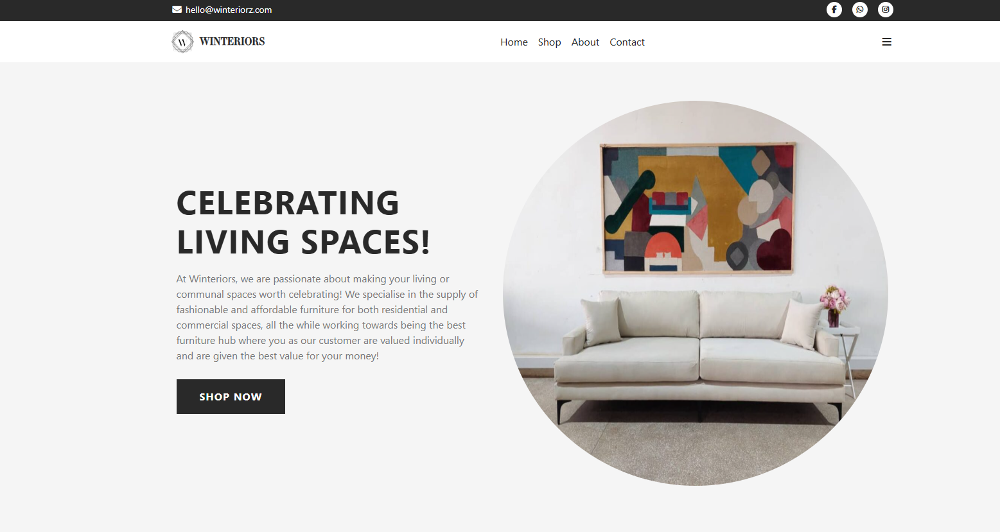
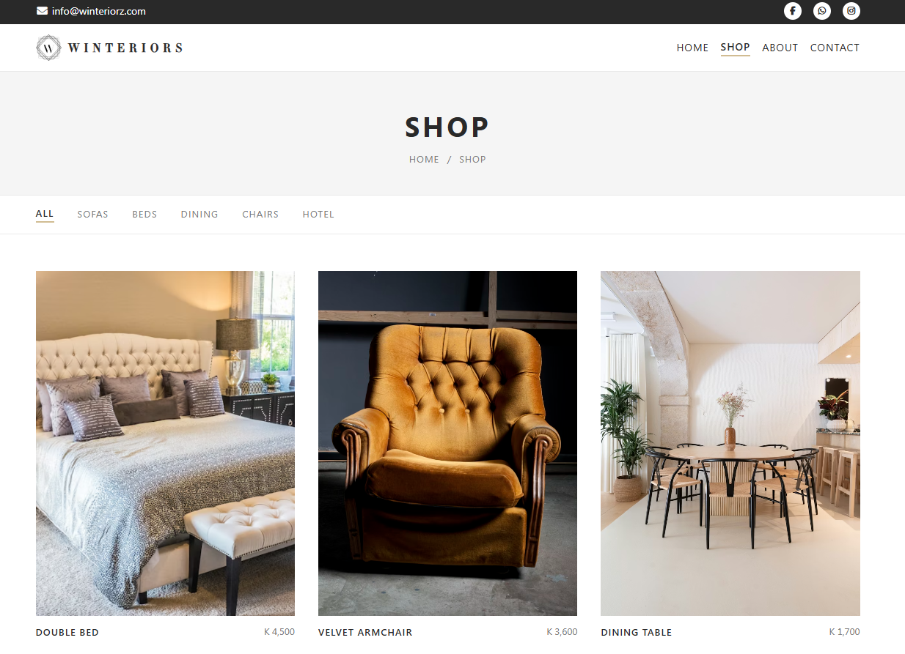
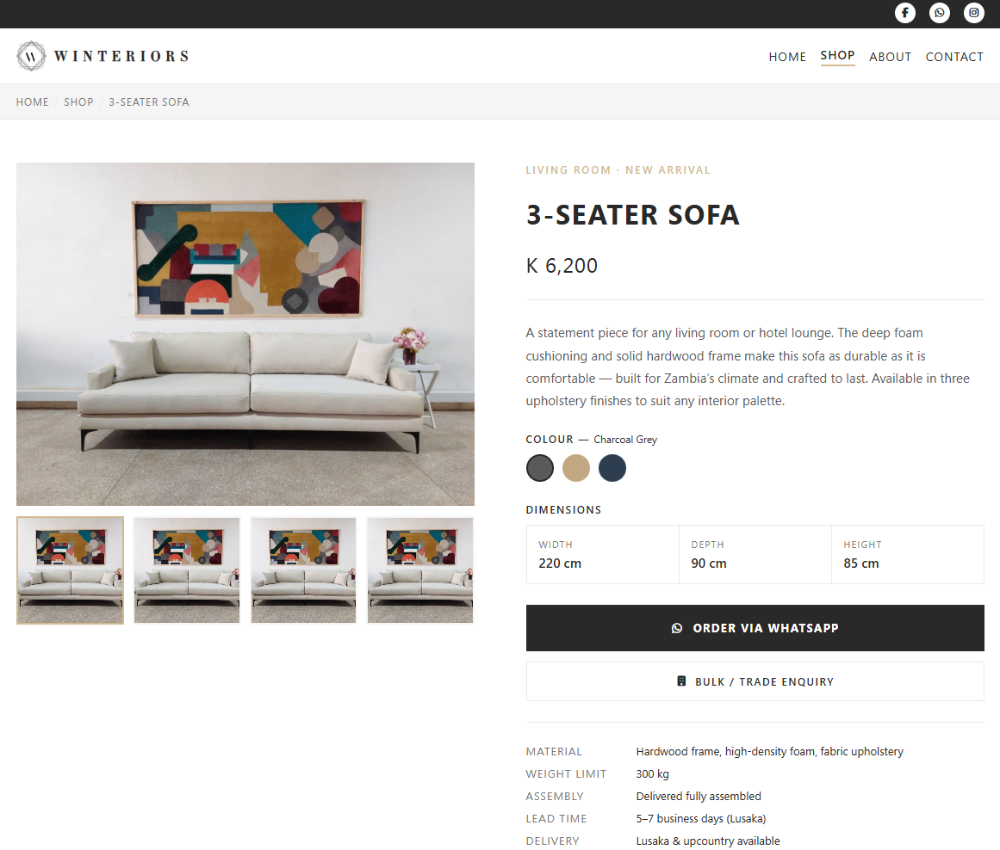
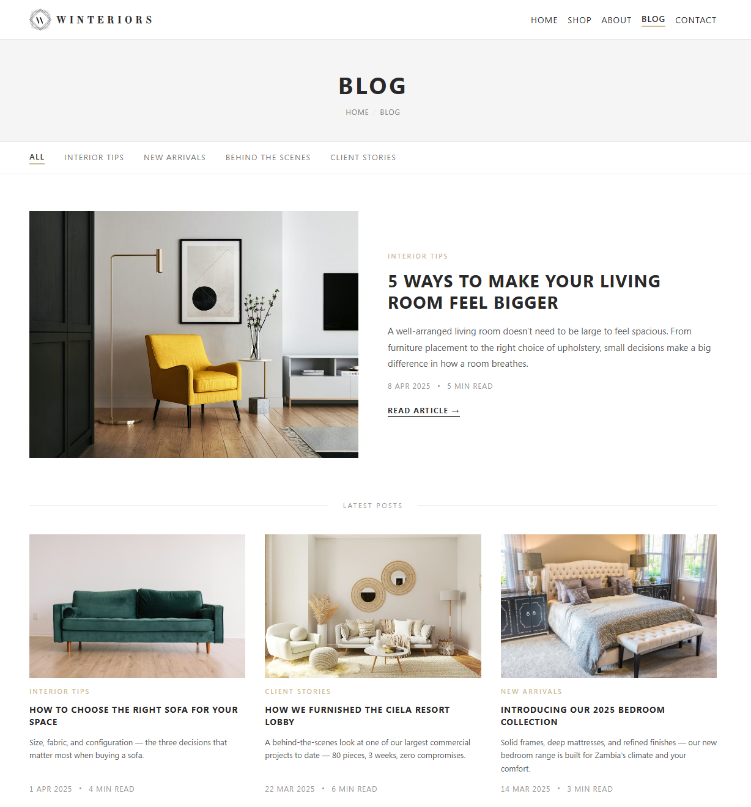
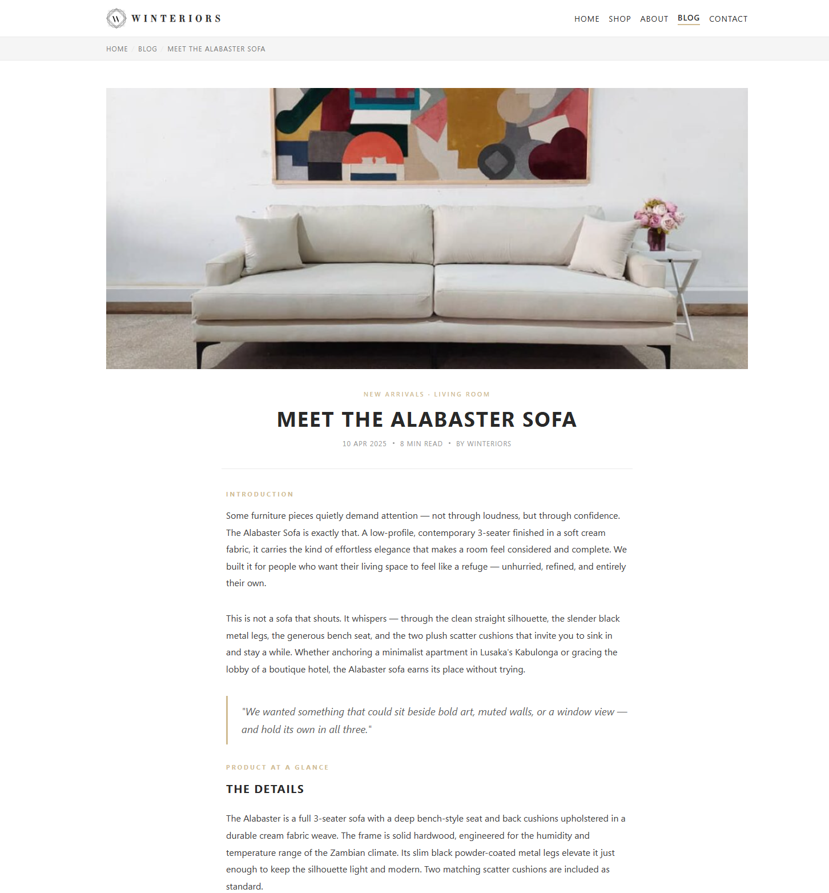
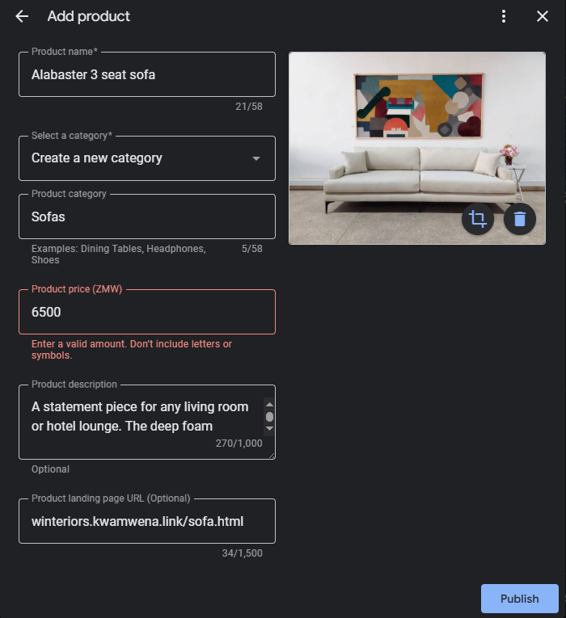

## Prompt

How do I check to see all the pages that are available on a website? Another way to ask the question is How do I list all the pages in a website?

What options do I have to preview a markdown file in the browser? Maybe use a Static Site Generator like Hugo, Astro or Jekyll. Just pick one with a nice default theme.

---

**Job Proposal**
- Introduction with Greetings
- Job Role Overview
- Why?
- Acknowledgement of Work
- Job Role In-depth
- First steps I will take once I get the role
- Who am I?
- Why I am suitable for the role?
- Conclusion (Expression of good faith)

**Job Role**
- Website Management
- Website Funnels (Contact Form on every page, Official WhatsApp Business link on every page, WhatsApp Group Signup on every page, Mailing List Sign up on every page)
- Personal page management
- WhatsApp Group management
- Google Structured Data management
- Goolge Search Results management
- Google My Business management

**First Steps**
- Reconstruct website (home, about us, contact, shop/services, blog)
- Send for review
- Construct WhatsApp group ()
- Publish website after approval
- Ask for 6 products with details
- Profile products (product page, article page, product list, article list, home page)
- Publish home page, blog list, article page, shop list, product page

**Sales Channels**
- Website
- WhatsApp Group
- Email (Newsletter, Special Email)
- Google My Business
- Google Search Results
- External (Reddit, Facebook, LinkedIn, X, Tik Tok)
- Stories
- Newsletter
- Personal (Website, Social Media, Stories)

**Website Fix**
- Problem
- Expected Behaviour
- Suggested Solution

**Deliverable**
- Application: Markdown > HTML/CSS > pdf
- CV: Markdown > HTML/CSS > pdf (Google Docs?)
- Website Fix: Markdown > HTML/CSS > pdf

---

Conclusion will read as follows:

I have attached the following documents:
- The application in pdf format.
- My CV in pdf format.
- The document detailing the fixes made to the website.

---

Social Media Strategy: Comment as your personal profile in news updates on major pages. Even on some controversial pages. What you are searching is high engagement, then look for comments with high engagement. Make sure your story is up to date. Add your take. If a person reacts invite them to like your page


---

One of the things that emerged as I was simulating what to include in what happens in the first week is a WhatsApp group and client interaction or client management. Let's look at Client Management. I believe that this is at the core of what makes sales happen. This is the part of the process that I think needs a lot of attention. A lot of care, a lot of consideration.

It involves simulating (role playing) scenarios where you would interact with a customer. Communication skills are necessary. Much attention needs to be placed making sure you put a lot of love and care into what you say. Understanding the client's needs. Being open minded and creative at the same time. Having information at hand. Answering comprehensively. Bear in mind that most client interaction will be chat app based. This maybe messages, voice notes, video notes, voice calls and video calls.

WhatsApp group needs a strategy for the first week. The idea is that there is information that should be included in the description of the group. So there is a Welcome message, welcoming people to the group. Then there is an info dump to help people adjust (highlight special products on offer, link to full catalog, how to pay, for enquiries contact the Admin on ...). Future consideration is making videos that showcase the products. Annotated videos in this case.

---

**First Steps**
- Construct website (home, about us, contact, shop/services, blog)
- Ask for 5 products with details
- Profile products (product page, article page, product list, article list, home page)

This has just emerged in the whole process of this exercise. This in regards to generalizing the role of an Online Sales Officer. So in this case the pitch would be to use a generic business website as a template to annotate your proposal. The proposal may also include Social Media Management. Emphasis has to be placed on what I would like to call Responsible Social Media Management for a business, where I do things according to a thoughtful, long-lasting strategy. The mindset behind it is that one distances themselves from hype, from trends, from loose content without a purpose. Instead the strategy is integrated to a unified content strategy. A content strategy that has goals, has intentions and is done with a lot of thought and care placed into it.

---

I am considering to leave out AEO in the first week plan. AEO is still new territory and can be explored later on when the chance is there. I may still keep it inside the whole gist of the job proposal. I hope it can be useful.

---

I have decided to revise the approach of this application. I am rechanneling my effort towards what it means to be a salesman. That is to say an online salesman. One who generates leads, one who closes leads. What does it mean to sell furniture to an online audience. Of course my starting point is the clean up of the website. I hope it will work as a sign of good will and hopefully be the necessary entry point that helps facilitate them considering the full role. Hopefully, it can make them see my proposal in a good light and take it in good faith. 

Let's look at what all this involves. For a start this involves the job proposal, the document detailing the website fix, my CV, application letter (so the application letter is the job proposal).

How will the application be sent? The application will be sent via email. The job proposal will be compiled both as an html/css email and as a pdf. The videos will be unlisted videos placed on YouTube. Links will be shared within the email. An end section like "Conclusion" or "References" will be placed at the end with the links to the videos, pdfs. A webpage will be created with the links to the pdf, videos as well. If time is available.

A word of caution. The website fix will not involve zeroing in on code. That's not the purpose. I believe the time will come for fixating on the attributes of the website. But now is not the time.

---

Thinking is best executed through simulation. That is imagining the steps you would take in order to achieve something, even if you have never done it before, you can approximate what it would take to get things done.

That way information gets revealed that further boosts your thinking and how you would approach things.

---

The things I want are the things that will make working easier. I need a worksuit, gumboots, rubber gloves, sacks, and a slasher. This is for waste collection. It's a hobby I enjoy engaging. I may also need money to pay the waste collectors each time I have to deliver to them sacks of waste. Oh I need googles too and a hat and sunglasses (shades) and a watch and a mbudzi phone.

For gardening, I will need a small garden fork, a small hoe, a watering can, a big hoe, a mechanism to burn grass so as to make potash. a way to load the potash in a bucket.

I may also need running shoes, a nylon tracksuit, a nylon T-shirt. At least 2 sets of these that I can alternate at will.

For the actual work, I need one laptop with at least 16GB RAM and a powerful enough fone with at least 8GB RAM memory and powerful CPU. At least a S23 Ultra

On the real, I need to cultivate discipline. Stay focused on the task at hand. Always resorting to divine intervention throughout. That's what makes it work. Be more than willing to help others at every opportunity. Just to keep going even when things are uncertain.

A maid and a garden boy to keep the surroundings up to date. A maid would be especially useful for the cooking, washing the dishes, laundry, ironing, sweeping and mopping. A garden boy would be especially useful for maintaining the garden, ssweeping outside, managing the trash, and doing odd errands.

---

Why am I suited for the role of an Online Sales Associate for Winteriors?

I am a web developer who enjoys working on projects that help businesses. In my few years of experience, I have created web-based apps for tech-based companies. This was done with the hopes of acquiring users for the businesses. 

Besides being a web developer, I am also a technical writer. I have authored articles for the online audience. Some were to help users solve their problems and some were for generating content for engagement purposes.

Coming across your project, I wondered how I could be of use. I thought of effective ways that could help increase business more than just fixing your website. A website, I believe can be more than just an informational tool. It can serve as a means to get more sales for the business. It's not simple but it's doable. I believe I have some expertise that can help lead to successfully getting more sales using the website.

I also hope that my efforts can spill over into other areas of the business and help complement their efforts. Be it in store sales or highlighting events happening at Winteriors, I hope my work would have helped in any way.

---

One content strategy to consider for the Winteriors website is polling. Polling in this case will be used to gauge opinion on certain designs before or after they have been made. It can help shape the company's decisions in terms of investing in a certain design shape, color, fabric, feature you name it. For example  a velvet chair with armrests or not. When unsure you can generate a design artificially then create a poll to see which approach has more validation.

Another content strategy is story telling. Story telling is quite unique and abstract. You are supposed to given an account or a narrative in a personal or interesting in a voice that sounds human and unique. For example, giving an account or story involving the design of a furniture piece. One can detail all that was involved in making it happen. From the frustrations, the second guessing to the decisions. The trade-offs, the remakes, the constant questioning and the prejudices that emerge in the creative process. Having to livw with your decisions. To be okay with the outcome of the design process. Then utter out the reflections and the hopes you carry for future projects.

---

One way to enable you to write something is through the process of simulation. Simulation is when you imagine a situation in your head then describe the sequence of events step by step. It is just triggered by a thought and the process gets revealed moment to moment.

Another way is to give an account of events. Like writing in a diary. That involves recalling the events of the day and narrating them in your own voice. Sometimes you can chime in with commentary and or reflections based on the events of the day.

---

How do I capture music ideas in my brain. When I am busy writing, there will always be a nice song playing in the background in my head. The voices sound nice and angelic. Sometimes the music will include instruments. Typical sounds I experience are Jazz, traditional African tribe music (drums), Black American 808/Trap/Hip Hop beats, classical orchestra music (imagine epic scenes from movies, Val Zimmer type of music). It has gotten to the point where I have to stop and think aobut the best way to approach this. Could 

---

I think I need to study writing. I just need enought command over the Engleish language to be comfortable enouth to express my ideas. Use language variances to make the writing process enjoyable and of course the output enjoyable as well when read. In order to achieve this, I think I may need to study programme that helps with English Language as well as writing too. I was thinking of a Literature Degree as stories are always interesting. They stimulate the mind and they are things one can immerse themselves in. However, there is alwasys some friction when startign out a story. It can be hard to get into it so some discipline is required to make it work. Apparently not many universities offer degrees that dive into Literature and English. Such a shoame

---

Simulation
This is a simulation of the steps I will take in order to acquire a job at Winteriors. I will first send an application for a job as a Online Sales Associate. 

The article will cover details about the role, why I want to take up the role, a little information about me for them to understand my background as well as the steps I will take once they agree to give me the role. What I expect from them to make my work more effective. Deliverables they should expect from me (whether weekly, biweekly or monthly). The performance review process to help them gather insights and help in future decisions. A provisional duration that I plan, after which the company can make an informed review based on the deliverables that I have outlined.

If they accept my application, I plan on negotiating a compensation package that is commensurate with the effort I plan to put as well as the outcomes I ultimately want to achieve. My ultimate goal remember is to help the business gain more sales via the online system (web) so all my effort will be channeled towards making that work. A starting point for me would be something around K5,500. This would be enough to cover living expenses as well as work related expenses like internet data, and airtime. The hope is that the compensation can include a percentage based commission like 5% for verifiable sales that I managed to close.

I will have to draft a contract based on the compensation. The contract will be a 6 month contract. I think that's enough time for the business to review and think about how to proceed with me. At the end of the contract we can have a short meeting to determine if we should proceed with a new contract or stop there. The contract will have clauses related to compensation, clauses related to my responsibilities as an employee, clauses related to the company's responsibilites as an employer, conditions for immediate termination of contract, code of conduct, channel for communication and so on.

Once the contract has been drafted, looked through, revised and then accepted, we proceed to sign the contract. Maybe we can include witnesses we will see.

After that I proceeed to execute my role immediately and hit the ground running. First week involves updating the website and making sure it works as expected. If given access to the domain,  I will immediately put an updated website that works.


I will move on to getting 6 products to profile. Profiling a product involves giving the product a name, a description, a price. In the shop page a grid of products will be on display with the image of the product, the name and the price.


The product page will include the name of the product, pictures of the product, a description, the available colours, the dimensions of the product, an Order via Whatsapp button which leads a user to want order the product.

The extra details I would include are the dimensions of the product, the materials used to make the product, any accompanying pictures of the product. Pictures must include all views front, back, sides, top, bottom, incorporated in a design decor, 360°, and so on. Any videos too. All these details will be arranged neatly in the product page on the website.
 

I will then include an article for the product in the Winteriors blog page. 

The blog will showcase a list of articles, some of which will showcase products that I am promoting. Here is how the blog list page will look:


Now for the specific article about the product. The article repeats all the information found on the product's page except in descriptive format. 

The article will include extra information like how to maintain the product, the inspiration behind making the product. How the product is cleaned, polished, dusted, wiped, deodorizing, scented, washed and so on. Where the product is best used including visual concepts of incroporating it in a room, or officce setup. 

Interior decor suggestions will be added as well for setups that account for most people. I can also include the pricing combinations for the product as a product can have variations. Then comes looking to related products that can accompany the product to work well as a pair or group.


Next comes adding the products to the Google My Business page of the business. It is in the hopes that visitors to the Winteriors business via the Google search engine can immediately see results in the search results page with products visible already.


Next, I will enhance the products with some SEO. I will research for keywords that work well with the products then update the product page and article page in a way that helps the search visibility of the product. I will have to check the rankings of the website in relation to relevant search terms.

After SEO, then comes sharing the products on online forums like Reddit, LinkedIn, business forums and so on. The main target is people who don't use Facebook and Instagram often, thus may not know of the business. The sharing of the products will involve creating accompanying posts that match with the vibe of the platform.

The online forum strategy will also be enhanced by engaging with posts that may be relevant to Winteriors business domain. Subjects centred around interior decor, office set up and so on. The idea is to provide valuable input that can help attract engagement and can turn into leads.

Next, I will update the website with a contact form feature. This will help grab leads. Here, visitors can either send a message and enter their WhatsApp number or their email address. I will configure a system that will retrieve these details and store them in a client database.

I would like to believe that Winteriors has either one of the following a WhatsApp group for informing clients or a WhatsApp channel for updating people on the products on offer. I will forward some of the contacts to the person responsible for managing the WhatsApp group. Alternatively, I can create another WhatsApp group, however I will still get updates from the main group.

---

Furniture with a purpose. One angle a furniture store cna use in order to sell products online is to attach a theme to it. For instance with the emergence of high quality internet and remote jobs, a significant portion of the population would want to work from home. Therefore they maybe interested in furniture tailored  towards a nice experience working from home. Like nice desks, comfortable chairs, comfortable pillows you can work for long hours on. A product strategy which first starts with designing desks that work well for remote work could be an angle. Of course the design choices could be partly informed by enthusiasts and partly inspired by the designer's own impression of what furniture for remote work ought to look like. Accompanying the product design strategy would be 

---

Include a Sales Workflow for each Sales Channel. This can help simulate the process by which one gets clients online. For instance, when someone visits the website after searching sofa online, then sees a page with a sofa on Winteriors website, then sees the price. Probably they have an impulse to want to inquire about the product. Most likely they will check the contact details and try to call a sales representative. In that case the website would have helped get a potential client.

---

Design Suggestion: When someone clicks a link like Shop Now or clicks on one of the products a pop-up notifying the visitor that an online product catalog is under construction and will be coming soon, in the meantime they can contact the Winteriors Team on some given contact details like phone number, email, WhatsApp and Facebook messenger.

---

Use kwamwena.link to load the Wino website. So the URL will be winteriors.kwamwena.link

---

The design of the Fino Loan Management System will piggy off the design of the Winteriors website Admin app. If I go far enough with the Winteriors application, I plan to design a product catalog system complete with the search, filter, sort, categorise functionality. Other systems to consider are an online inventory management system (without payment order management), then an order management system (store pick up) no payment gateway used. Then a checkout system tied with the catalog system and order management system and inventory management system. This could evolve into deeper concepts like WhatsApp, SMS and Email automation. And of course then including a payment gateway and a POS system for the physical branches tied to the inventory management system. This can keep going into stuff like delivery system (Order Fulfilment System)

---

Here is the revised CSS Design Approach. Add HTML for the content only. Define outer layout in written form. Draw the layout on paper, svg, and/or Figma. Code out the layout using HTML and CSS. Define the width and height of the layout. Draw the layout with the updated width and height

---

What I thought I needed to do, was just to update the website and send in my application. It turns out I have to first make sense of things. Why they exist? What value they bring? It turns out it's a rabbit hole. Now I have to figure out a prioritization strategy.

- CV (Technical Writer, Software Developer, Community Manager)
- Application Letter
- Cover Letter
- Document outlining the role of an Online Sales Associate
- Renewed Website link
- Document describing the changes implemented on website (includes problems)
- Document describing how to set it all up
- Document outlining future considerations
- Document for Website Maintenance

- SEO
- Reddit Content Strategy
- Product Catalog Content Strategy
- Blog Content Strategy
- Home Page Content Strategy
- Contact Form System (CRM)


---

Add HTML, define layout, draw layout(horizontal or vertical), code layout (HTML then CSS), define width and height, redraw layout, code width and height, define alignment, draw alignment, code alignment(horizontal or vetical), define spacing, draw spacing, code spacing (horizontal or vertical)

---

So what is the actual CSS design approach? We define a structure, either horizontal or vetical. After defining a structure we proceed to look at dimensions of the full layout. Is it going to cover the full width of the view? Is it going to be a fixed width or a variable width? What is the height? Is it a hard coded value? or is it variable, maybe based on the dimensions of the inner elements (margin, padding)?

Define a fixed width and fixed height to start.

Next comes alignment of inner elements of the layout. For vertical alignment are all of them centered or are they at the top or bottom of the layout?

Next comes the vertical spacing. In this regard spacing between the outer layer and the inner elements. Usually defined by padding.

Then comes the horizontal spacing. In this regard spacing between inner elements. Is it explicitly defined, hardcoded or computed?

Elemental design: Define dimensions, alignment, spacing within an element's container. Adjust based on visual feedback

**Intruding Thought**: The margin for the outer layer of a section should be defined only when all the other sections have been combined in view, then from visual feedback a number can be figured out.

## CSS Design Approach

Let's look at a design approach using HTML and CSS that can be used on websites. The first thing to consider is the raw HTML. In this description, I will use a structure like a Header to guide my thinking.

Typical headers have the following structure: a Logo on the left, quick menu links in the middle and then a menu dropdown to the right. Some are sticky, some are sticky on scrolling up, depends on preference and perceived use case.

Back to the first step, in the design process. One should start with the raw HTML without any divs persay. Something like this:
```html
<!DOCTYPE html>
<html lang="en">
<head>
    <meta charset="UTF-8">
    <meta name="viewport" content="width=device-width, initial-scale=1.0">
    <title>Wino</title>
</head>
<body>
    
    <h1>Wino</h1>
    <h2>Menu</h2>
    <ul>
        <li><a href="#">Home</a></li>
        <li><a href="#">Shop</a></li>
        <li><a href="#">About</a></li>
        <li><a href="#">Blog</a></li>
        <li><a href="#">Contact</a></li>
    </ul>
</body>
</html>
```

The next step is to define a structure. We don't want the default vertical layout given by the browser. We want our header to appear horizontally with all the text items appearing in a row.

To achieve that effect, we will use a flexbox. To implement a flexbox, we first have to wrap all the header items in an html element called a `header` like so:
```html
<header>
     
    <h1>Wino</h1>
    <h2>Menu</h2>
    <ul>
        <li><a href="#">Home</a></li>
        <li><a href="#">Shop</a></li>
        <li><a href="#">About</a></li>
        <li><a href="#">Blog</a></li>
        <li><a href="#">Contact</a></li>
    </ul>   
</header>
```

Next add a style attribute in your opening header tag and give it the CSS declaration: `display: flex;` like so:
```html
<header style="display: flex;">
```